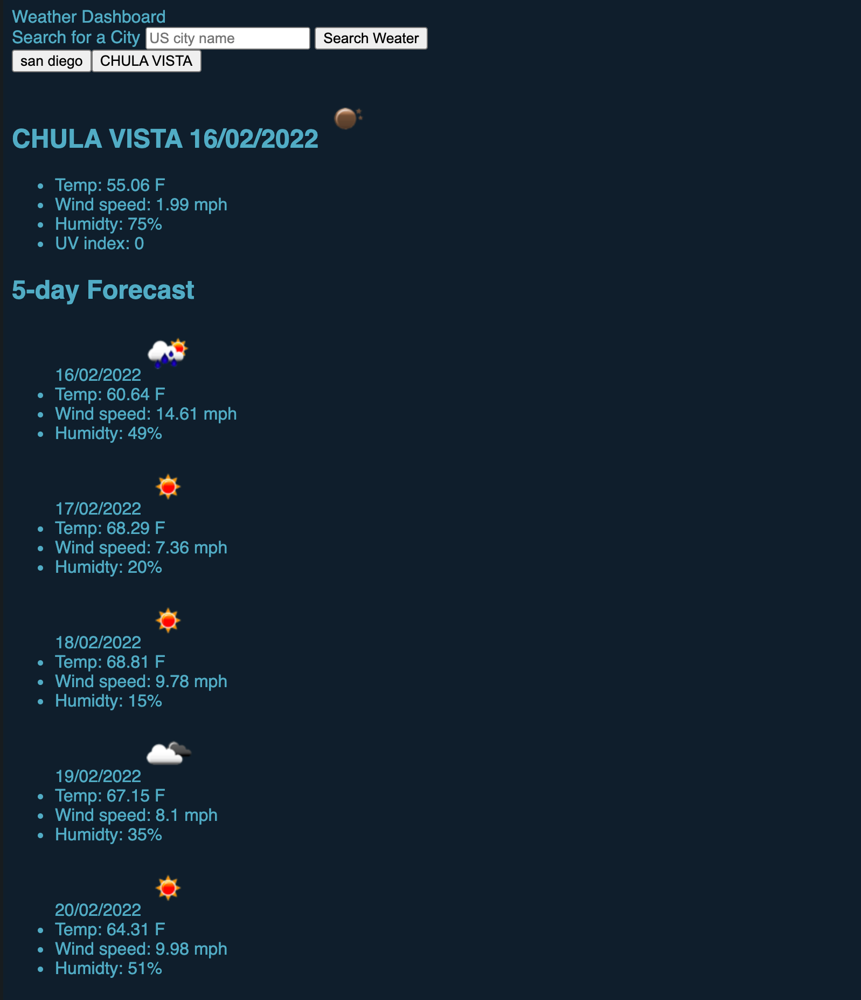

# Weather-Dashboard

## Description

Third-party APIs allow developers to access their data and functionality by making requests with specific parameters to a URL.

## Usage

- [Github](https://github.com/ngolston/Weather-Dashboard)
- README.md

## Technology

- HTML
- CSS
- JS

## Credits

- Dillan Mansor
- Davis Ransom
- Jeffrey Young
- Thao Nguyen
- Parisa Ostovari
- Caroline Pastorelli
- And Everyone Else 😁🙏🏾
